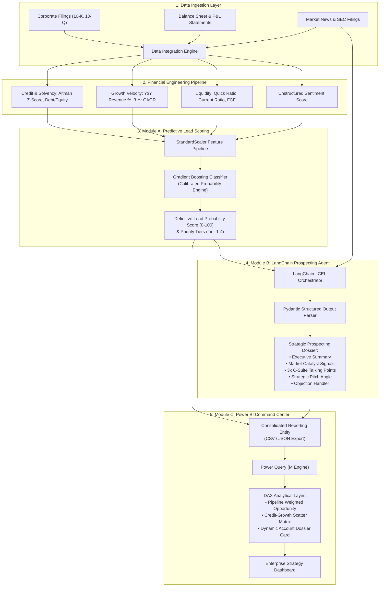

# AI-Powered Institutional Prospecting Engine
> **Enterprise B2B Lead Scoring, Generative Sales Intelligence & Strategic Power BI Cockpit**

[](https://www.python.org/)
[](https://scikit-learn.org/)
[](https://python.langchain.com/)
[](https://powerbi.microsoft.com/)
[](LICENSE)

---

## 1. Executive Summary & Core Objective

The **AI-Powered Institutional Prospecting Engine** is an institutional-grade intelligence platform engineered to transform raw financial statements, credit health metrics, and market signals into high-conviction B2B sales opportunities.

Traditional enterprise prospecting suffers from:
- Subjective rep prioritization leading to wasted sales cycles on insolvent or stagnant accounts.
- Cold, generic outreach devoid of fiscal context or balance sheet awareness.
- Disconnected BI dashboards that display backward-looking metrics without prescriptive actions.

This engine solves these challenges through a three-module architecture:
1. **Module A (Machine Learning / Scikit-Learn)**: Evaluates corporate creditworthiness, solvency (Altman Z-Score proxy), and growth trajectory to output a calibrated **Lead Probability Score (0–100)**.
2. **Module B (Generative AI / LangChain)**: Synthesizes structured balance sheet diagnostics with unstructured market disclosures into an executive **Prospecting Dossier** complete with tailored C-suite talking points and strategic pitch angles.
3. **Module C (Business Intelligence / Power BI)**: Visualizes priority tiers, credit-vs-growth matrices, and dynamic AI dossiers to equip revenue strategy teams with an interactive command center.

---

## 2. End-to-End System Architecture



---

## 3. Technical Stack

| Layer | Technology | Version | Purpose |
| :--- | :--- | :--- | :--- |
| **Data Processing & ML** | Python, NumPy, Pandas, Scikit-Learn | Python 3.10+, Scikit-Learn 1.4+ | Financial ratio derivation, feature normalization, and calibrated classification |
| **Generative AI** | LangChain Core, LangChain Google GenAI, Pydantic | LangChain 0.2+, Pydantic v2 | Prompt orchestration, schema validation, multi-provider LLM synthesis |
| **Business Intelligence** | Microsoft Power BI Desktop, DAX, Power Query M | Latest | Interactive executive reporting, dimensional modeling, dynamic dossier card |
| **Quality & CI/CD** | Pytest, Joblib, Dotenv | Pytest 8.0+ | Automated unit testing, model artifact serialization, configuration management |

---

## 4. Module Specifications

### Module A: Predictive Lead Scoring Model (Scikit-Learn)
- **Mathematical Formulations**:
  - **Altman Z-Score Proxy (EM-Score)**:
    $$\text{Z-Score} = 6.56 X_1 + 3.26 X_2 + 6.72 X_3 + 1.05 X_4$$
    - $X_1$: Working Capital / Total Assets
    - $X_2$: Retained Earnings (Net Income Proxy) / Total Assets
    - $X_3$: EBIT (EBITDA Proxy) / Total Assets
    - $X_4$: Market/Book Equity / Total Liabilities
  - **Revenue Velocity**:
    $$\text{Velocity}_{\text{YoY}} = \frac{\text{Revenue}_t - \text{Revenue}_{t-1}}{\text{Revenue}_{t-1}}$$
  - **Debt-to-Equity Ratio**:
    $$\text{D/E} = \frac{\text{Total Short & Long Term Debt}}{\text{Total Shareholders' Equity}}$$
- **Predictive Architecture**:
  - Algorithm: Calibrated `GradientBoostingClassifier` with ensemble tree pruning.
  - Probability Calibration: Scaled strictly to $[0, 100]$ as `lead_probability_score`.
  - Tiers:
    - **Tier 1 (Strategic Alpha)**: Score $\ge 80.0$
    - **Tier 2 (High Conviction)**: $65.0 \le \text{Score} < 80.0$
    - **Tier 3 (Medium Priority)**: $45.0 \le \text{Score} < 65.0$
    - **Tier 4 (Monitor / Nurture)**: $\text{Score} < 45.0$

### Module B: LLM Prospecting Agent (LangChain)
- **Prompt Architecture**:
  - System Persona: Principal Enterprise Prospecting Strategist.
  - Input Features: Quantitative balance sheet health, Altman Z-Score tier, and qualitative press release disclosures.
  - Output Structure: Validated via Pydantic (`StrategicProspectingDossier`).
- **Resilient Fallback Engine**:
  - Supports Google Gemini (`gemini-2.5-flash`), Groq (`llama-3.3-70b-versatile`), and an institutional heuristic fallback generator for air-gapped CI/CD environments.

### Module C: Business Impact & Dashboarding (Power BI)
- **Data Model**: Star-Schema reporting entity (`Prospects`) with 30 production dimensions and metrics.
- **Key DAX Measures**:
  - `[High Conviction Targets]`
  - `[Probability-Weighted Pipeline ($M)]`
  - `[Lead Qualification Rate %]`
  - `[Selected Account AI Summary]`
  - `[Selected Account Talking Points]`
- **Interactive Visuals**:
  - Quadrant Scatter Matrix (Solvency vs Revenue Velocity).
  - Target Leaderboard with dynamic score data bars.
  - Responsive AI Talking Points card that updates dynamically on table row selection.

---

## 5. Repository Structure

```
AI-Powered Institutional Prospecting Engine/
├── .env.example                       # Environment configuration template
├── .gitignore                          # Standard git ignore definitions
├── requirements.txt                    # Python dependencies
├── run.py                              # Master CLI execution pipeline
├── README.md                           # Enterprise architecture documentation
│
├── config/                             # Global configuration files
│
├── data/                               # Data storage (Raw, Processed, Export)
│   ├── raw_companies.csv               # Corporate lead profiles
│   ├── financial_metrics.csv           # Balance sheet & P&L metrics
│   ├── market_news.csv                 # Unstructured news & catalysts
│   ├── lead_features.csv               # Engineered feature matrix
│   ├── institutional_prospects_powerbi.csv  # Final Power BI dataset
│   └── institutional_prospects_powerbi.json # JSON format export
│
├── models/                             # Serialized ML artifacts
│   └── lead_scoring_model.joblib       # Trained Scikit-Learn pipeline
│
├── powerbi/                            # Power BI resources
│   ├── schema_definition.json          # Complete JSON data schema
│   ├── dax_measures.dax                # 15+ Production DAX measures
│   └── powerbi_setup_guide.md          # Step-by-step layout & M-script guide
│
├── scripts/                            # Operational utility scripts
│   ├── generate_synthetic_data.py      # Synthetic multi-industry generator
│   ├── run_scoring_pipeline.py         # Module A standalone runner
│   └── run_prospecting_agent.py        # Module B standalone runner
│
├── src/                                # Core Engine Source Code
│   ├── __init__.py
│   ├── config.py                       # Central path and hyperparameter config
│   ├── feature_engineering.py          # Financial ratio derivation pipeline
│   ├── predictive_model.py             # Module A: ML Scoring Model
│   ├── llm_agent.py                    # Module B: LangChain synthesis agent
│   └── pipeline.py                     # End-to-end orchestration runner
│
└── tests/                              # Automated test suite
    ├── __init__.py
    ├── test_feature_engineering.py     # Feature calculation verification
    ├── test_predictive_model.py        # Model bounds and training tests
    └── test_llm_agent.py               # Prompt and Pydantic parsing tests
```

---

## 6. Quickstart & Execution Guide

### Prerequisites
- Python 3.10 or higher installed.
- (Optional) Google Gemini API key or Groq API key for live LLM inference.

### Step 1: Clone Repository
```bash
git clone https://github.com/HridaySharma2002/ai-powered-institutional-prospecting-engine.git
cd ai-powered-institutional-prospecting-engine
```

### Step 2: Install Dependencies
```bash
pip install -r requirements.txt
```

### Step 3: Configure Environment
Copy `.env.example` to `.env` and set your API key:
```bash
cp .env.example .env
```

### Step 4: Run the Complete Pipeline
Execute the master runner to generate data, train the model, synthesize prospecting dossiers, and export Power BI files:
```bash
python run.py --regenerate-data
```

### Step 5: Run Automated Tests
```bash
pytest tests/ -v
```

---

## 7. Power BI Dashboard Setup
1. Launch **Power BI Desktop**.
2. Navigate to **Get Data** -> **Text/CSV** and select `data/institutional_prospects_powerbi.csv` (or use the M-Script in `powerbi/powerbi_setup_guide.md`).
3. Import the DAX measures from `powerbi/dax_measures.dax`.
4. Follow the layout blueprint in `powerbi/powerbi_setup_guide.md` to configure the Scatter Matrix, Target Leaderboard, and AI Account Dossier Card.

---

## 8. Author & Credits
- **Architect & Author**: Hriday Sharma
- **GitHub**: [@HridaySharma2002](https://github.com/HridaySharma2002)
- **Role**: Lead AI Architect & Senior Business Analyst
